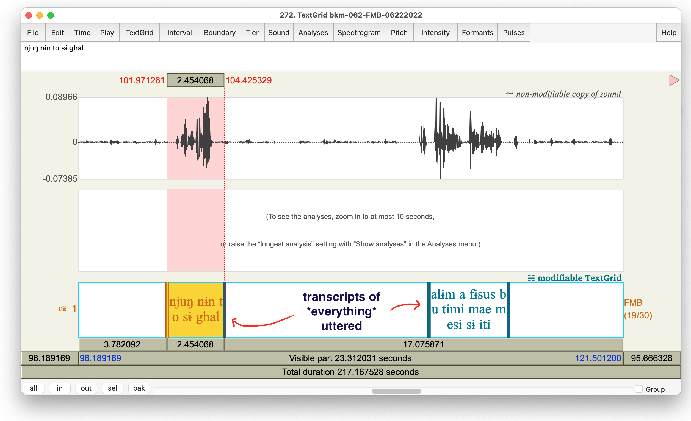

% Annotation: waveforms, spectrograms, airflow
% 13 December 2022  UC Shattuck Plaza
% Matthew Faytak (Univ. at Buffalo) 

## Overview

Annotation in Praat

* Navigating Praat and TextGrids
* Placing boundaries using waveforms and spectrograms
* Choosing (and regularizing) labels
* Miscellaneous tips

Partial automation of annotation

Troubleshooting the airflow records

* Good records
* Bad records
* How to spot them

# The annotation task

## The task

The task of annotation is basically assigning **text labels** to **bounded spans** of an audio file

* Without these, we can't do any kind of analysis
* Scripts generally can't find labels or boundaries *for* us 
* We'll discuss *forced alignment* at the end, which can do some of these things but requires very specific pre-conditions

These bounded spans (intervals) of the file correspond to segments or subsegments, depending on the nature of RQs

## The task

This is **very different** from the annotation task given to you in 2019

* We are not manually annotating oral/nasal airflow maxima or minima (etc)
	* This will be left to scripts 
	* Some of it will be replaced with flow volume/rate means or trajectory modeling
* We are not dedicating specific tiers to each airflow channel
	* Just have a tier for segments 
	* Tiers for subsegments if desired (flexible, RQ-dependent)
* No point tiers (at least not required)

There are pros and cons to this change:

* Less manual annotation by fieldworkers; more time to dedicate to other things, more flexible
* Consistent segmentation becomes very important, must be systematic to a greater degree

## Your work setting

For quality and consistency purposes:

* Use **headphones** to listen
* Use your ears *and* your instrumental displays to segment
* Use **Praat**
	* Why not ELAN? You need a spectrogram; better waveform
	* Praat is also very similar to ELAN in its general structure
* Use **TextGrids** (.TextGrid format)
	* Very similar to ELAN .eaf files

## Use the *entire* file

We suggest using **all channels** of the recording (including airflow) to annotate

* The airflow masks exert an overall "muffling" effect on the acoustic signal
* Reduced amplitude of high-frequency energy: less energy in fricatives, affricates, stop bursts
* **Oral airflow** may be more reliable than the audio record for the timing of events for fricatives, stops, and affricates
* You can check that your recordings look OK and set them aside if not

But be careful not to draw boundaries solely based on **nasal airflow**

* Using nasal airflow risks circularity
* "I defined nasal vowels as those vowel intervals with high nasal airflow" ... "we find that nasal vowels have higher nasal airflow than oral vowels"
	* Of course they do!

# Basic Praat

## Object window

Praat opens with **Objects** and **drawing** windows; you can generally ignore the drawing window and focus on the object window

* Note that I capitalize objects as Praat does (Sound, TextGrid, LongSound, etc)

Praat obligatorily interacts with objects through *selection*

* For example, the following options become available if you open a Sound and select it

## Saving from the Objects window

The Objects window stores objects in memory but doesn't save them to your system. You must **save them** or your progress will be lost

* In nearly all cases, you will be creating, editing, and saving TextGrid objects rather than Sounds
* More on TextGrids in a bit

## Accessing the manual

Finally, there is a **manual** accessible from the Objects window (and several other places)

If you have minor issues with Praat, you can ask me, but try to check the manual first

 

## View and Edit window

If you select (an) editable object(s) and choose "View and Edit", the window where we will do most of our work opens

* Here, I've selected a matching Sound and TextGrid (which already contains some annotations)

## TextGrids

Most of our annotations will be done as TextGrids

* Create by selecting "Annotate", "To TextGrid", and filling in tier names you want

 

## Tiers and their contents

TextGrids contain **tiers**, which in turn contain **intervals** or **points**

* TextGrids are automatically the same duration as their associated Sounds
* Intervals have a start time, end time, and label
* Points have a time and a label

* Both tier types can be *written* directly into
* Both accept IPA characters 

## Points vs. intervals

The two kinds of tiers reflect different types of **audio selection**

* Points correspond to instantaneous, single time points
* Intervals correspond to ranges of time

Generally, in this project, we are interested in **ranges** corresponding to particular articulatory states, so we mostly favor using intervals

* Exceptions: flaps or stop bursts, which are more or less instantaneous

## Editing TGs

Efficiently adding boundaries to a TG depends on **keyboard shortcuts**

Zooming:

* CTRL+I, CTRL+O: zoom in and out
* CTRL+N: zoom to range/interval selected
* CTRL+A: zoom out to all

Scrolling: 

* Scroll left/right to move viewing window
* ALT+arrow key to move selection from interval to interval (or point to point)

## Editing TGs

Placing boundaries: 

* Make a point selection and click the little circle in the tier
* *Or* make a point selection and press CTRL+# 
	* Where # is the tier number you want to add a boundary to
* *Or* do CTRL+# with a range/interval selection to place both start and end times
* All of these methods can *time-lock* boundaries to a single time selection, which is desirable
	* i.e. word and phone start/end at the same time

## Playtime

If you haven't been following along, let's take a couple of minutes to try out some of the basic annotation tricks we've gone over

* If you are having difficulty setting anything up, ask
* If you are completely lost, ask us and get un-lost

# Choosing labels

## Labeling vs transcription

Labeling intervals/points for phonetic analysis is not, strictly speaking, *phonetic* transcription

* More like phonological transcription
* At most, broad phonetic transcription (omitting some unimportant or non-contrastive aspects of variation)

Rather, think of these as a *restricted vocabulary* which we mark off our experimental conditions of interest

* Where our experimental conditions are segments (current segment, current segment's environment as defined by neighboring segments, etc)

## Should I transcribe variation?

Generally, **no!** Variation should **emerge** from the phonetic analysis rather than being imposed by our transcriptions

* Besides, detailed transcription of variation actually makes analysis *more difficult*
* Script needs *regular, predictable* labels to find all segment tokens
* If not predictable, then we have to add a task of finding all the variants

## Socially conditioned variation

This includes **sociolinguistic** variation, which you may be noticing after your first field trip (or for a longer time)

* Again, we want the patterns of variation to *emerge* from a common annotation system shared by all varieties of the language
* Subphonemic analysis will capture the different realizations; you don't have to do it in your transcription

## Example: don't

Suppose we hear some weak voicing of /p t k/ when they are intervocalic, especially in a word which is nasalized due to harmony and where the /p t k/ are supposedly "transparent"

So we transcribe as we go along, variously:

* /p/ in /VpV/ as [b], [b̥], [ⁿb], [ⁿp], [bp], etc. 
* /p/ in /ṼpṼ/ as [b], [b̥], [ⁿb], [ⁿb̥], [ⁿp], [ⁿbp], etc. 

This is a *problem* for analysis, especially if we aren't tracking the transcriptions we are using

* How do we know which phoneme, /b/ or /p/, is represented by, say, any given [b]?
* How do we *get all tokens of* any given phoneme if their labels aren't consistent?

## Example: do

In this case, even though it is counterintuitive, /p t k/ should always be given the labels **p t k** regardless of voicing, nasal leakage, etc

* Closer to phonemic labels than anything else
* Easy to find all /p t k/ in later analysis
* Degree of voicing, nasal leakage, etc will be found in the course of analysis of acoustic/airflow data

## An exception: harmony

Harmony outcomes *should* be fully specified for any segment which is described as an undergoer

* Again, use consistent, restricted labels whenever possible
* e.g. give any vowel which is *supposed to be* nasal as Ṽ regardless of perceived nasal quality
* e.g. give all voiced oral consonants /b d g/ as nasal [m n ŋ] when in a nasalized word/harmony span

Why? 

* Most "experimental" conditions for research questions are based on nasal/oral spans
* If we don't mark output of harmony, we have to search the whole word for a trigger and apply rules to get the output... but in a script

# Segmental and subsegmental boundaries

## Be accurate!

Accurate placement of segmental boundaries is essential for analysis relating to some questions

* Closures, vowels, etc must be precisely marked off at the time points they occur at
* Failure to do this will lead to portions of other segments being spuriously included in your analysis span
* Might erroneously think a big jump in, e.g., nasal airflow occurs during a segment when it really occurs *before* or *after* it

If you are unsure of how you're doing, annotate a small portion of the data and *ask Matt* to check on it

## Voicing

Visible as **voice bar** at bottom of spectrogram, and as periodic (repeating, regular) motion in waveform

## Partial voicing

Segments can be partially voiced, with the voicing tending to be "carryover" 

* "Carryover" voicing intervocalically, from previous vowel
* Partial devoicing (pictured below) towards end of a voiced closure

* You might annotate the timing of voicing as a *subsegmental* property to determine effect of nasality on voicing or vice-versa

## Voicing and echo

Don't be fooled by echo, especially in very reverberant recordings and when low vowels or other intense sounds echo

* Echo can resemble a voicing bar extending into a following stop or fricative
* The token of /kʷ/ (from Piaroa) below is not substantially voiced, for example

## Glottal stop and creak

Glottal stop is rarely an actual stop (CITE)

* Often a period of **creakiness** instead
	* Vocal fold pulses further apart, often irregularly spaced
* Creakiness is also often associated with **glottalized** stops

## Vowels and formants

Vowels are easily identified by their clear, high-amplitude (dark) **formats** with little to no frication and strong voicing

* First and second formants (F1-F2) are the major determinants of vowel quality
* Some higher formants can be weaker (lighter) for especially constricted vowels

## Oral vs. nasal(ized) vowels

Compared to oral vowels, nasal(ized) vowels have more "smudging" of formants; noticeably weaker (lighter) F1

* (Acoustically, this is due to "antiformants" that overlap with formants and partly cancel them out)
* A very smudged "effective F1" results

## Formant discontinuities

Many other phones have clear formants as well, but cause **discontinuities** in formant frequency when articulated in a sequence with vowels 

* These discontinuities are useful for segmentation
* Lateral and central approximants
* Nasal stops

## Nasal stops

Abrupt loss of formant intensity visible in spectrogram; major dip in intensity in waveform, formants "smudge", effective F1 visible (and not much else, unless very intense)

## Central approximants

Gradual decrease and then rise in amplitude, formants deflect towards the approximant target and then back

* Segmenting these from neighboring vowels can be tricky; best to go by ear and pick the "halfway" point

## Laterals

Most non-"dark" [l] have a sharp discontinuity in formants: formants shift; amplitude abruptly lowers a bit

"Dark" [l] may show a more gradual change in values (and decrease in intensity) like a central approximant

## Plosives

Multiple articulatory events; annotate these together as the plosive or annotate sub-parts, depending on your RQs

* Closure
* Release (can be annotated as a single stretch to yield **voice onset time**)
	* Burst (spike in waveform)
	* Aspiration ("on" following vowel, but should be annotated as part of the consonant)
* Release ends when vowel's normal formant structure and voicing begin

## Plosive voicing

Plosives can be **prevoiced**, with their voicing bar plainly visible even during closure

More commonly, voiced plosives are somewhat devoiced (recap)

Unvoiced plosives can also gain some **carryover** voicing from the preceding vowel: voicing not "shut off" quickly enough

* Voicing carryover (during closure)

## Partially nasal consonants

Prenasalized stops (to take one possible example) may show oral and nasal closure portions; the transition between these can be spotted with some effort

* These (from Mundabli, Cameroon) may or may not be typical of "Amazonian" partially nasalized stops, but they provide us with a starting point

Another example:

## Affricates

Like plosives, there are multiple events that could be segmented

* Similar to plosives with the addition of **frication** to release
* Usually not worth separating from aspiration (or possible to do so)

## Trills and taps

Usually easy to segment: quick contacts (multiple for trills, single for flaps/taps)

* Taps don't lend themselves too well to interval segmenting, since they are so short as to be sort of instantaneous
* See the point tier below: brief closures between the tongue and palate

## Trills and taps

Both of these sounds can *fail*, however

* Flaps can close incompletely (intensity dip still visible)
* Trills can fail to start trilling (for aerodynamic reasons); approximant or fricative may result

# Automation

## Automatic creation of TGs

There are any number of basic Praat **scripts** out there to automatically create TextGrids with a certain tier structure

* I will demonstrate one such **auto-opener** script here:
	* Look at each WAV name in a folder
	* If no TG exists in a designated location, create it there with specified tier structure
	* Open the resulting TG and 
* Copy-paste <a href="https://github.com/mfaytak/ultramisc/blob/master/scripts/file-management/ultra_labeler.praat">the code</a> into a text file and save as [some name].praat

## Forced alignment

It is, in fact, also possible to automatically annotate sound files through a process called **forced alignment**, but the required materials may not exist for all project languages

* I recommend the <a href="https://montreal-forced-aligner.readthedocs.io/en/latest/">Montreal Forced Aligner</a> (MFA), which can be trained on your data set and then run on it

You need: 

* An *orthographic transcript* or *phonemic transcript* for every item, aligned to the audio with a one-tier TextGrid like the one below
	* This assumes there is some audio you don't want aligned, which isn't marked off on this TG. 
* A *pronunciation dictionary* which clarifies how to map every word occurring in the data set to a string of phonemes
* A lot of data: the larger the data set, the more accurate the alignment that results

## Forced alignment

Pros:

* Saves time (though not all of it)
* Reduced human error/typos in labels

Cons:

* Doesn't annotate subsegments
* Extra processing steps
* Decisions about how to mark labels can be complicated
* Still need to make a TG (though you can use the auto-opener script for this)
* Needs to be hand-corrected (accuracy isn't great)

## Using forced alignment

A possible workflow:

1. Auto-create "guardrail" TGs such as the one below, using the auto-opener

2. Create dictionary of all words in your stimuli, plus any other words which are not in stimuli but which are uttered
3. Run MFA on *all speakers at once* (can take a few hours)
4. Hand-correct the resulting TGs (again using the auto-opener)

... or you can just annotate by hand. Still, if you are interested, let me know, and my RA next semester may be able to help

# Airflow troubleshooting

## Airflow inspection

In theory, *when you record*, you should be looking at your airflow records to quickly check whether there are big problems

* Mask **leakage** due to poor sealing (discard acq)
* Lack of **separation** of channels (discard acq)
* Other, more mysterious, systematic problems which we have not yet identified (save and let us know)

## Leakage / mask seal problems

Mask may not seal with face fully: sensors can't sense flow changes in this case

* Slight tendency for the oral channel *alone* to be affected (in 2 datasets I've inspected)
* Flat or very low-amplitude traces; very low variation even when some is expected
* Or, you've lost a circular "screen" in one of the holes (impedes airflow enough for sensors to work with)

An example: Kawahiva [ɛdʒupĩn] 'climb!'

## Flow separation problems

If you get **identical** flow for oral and nasal channels *during speech*, then you may have a leakage problem

* Mask partition was not separating oral and nasal flow

An extreme example: Kawahiva [tata] 'fire':

## Flow separation problems

A (probably) more typical example: Kawahiva [ɨtʃĩŋga] 'sand'

* While not an *exact* copy, the channels are suspiciously similar
* Spikes in nasal airflow apparently not timed to the [ŋg]

* Good token, same word 
* Spike in nasal flow, clear reduction in oral flow at the same time (during [ŋg])

## Scale problems

Make sure to look at *speech* when inspecting, and *only speech* (not breathing before/after)

* Breathing (especially through open vocal tract) produces big swings in airflow
* Both Praat and the post-acq display software scale airflow (and audio) displays to fill the display area
	* A big inhale/exhale will make speech look like a very small fluctuation (due to scale)

## More examples (in Praat)

Note that in Praat, we expect **pulsing** of oral and nasal flow signals to be visible

* Due to voicing's effect on flow out of the lungs (less flow when vocal folds close, more when open)

Kubeo all-nasal [mẽnẽmẽ] 'tree sp.'  

* Nasal airflow spikes during the nasal stops
* Low, even oral airflow throughout (possibly a bad oral seal)

## More examples (in Praat)

Kubeo all-"oral" with voiced consonants: [bedebo] 'duck'

* Oral airflow spikes at stop release
* Nasal channel  suggests some slight velic opening ("leakage") during voiced stop closure
* Enhancement to voicing?

## More examples (in Praat)

Kubeo [nɨ̃kakɨ] 'I went' with a voiceless stop (and a variety of other segments)

* No velic leakage during the [k]
* Unlike for, say, [b] or [d] in the previous slide

# Airflow "zero" recordings

## Zero recording method (reminder)

Take a zero recording before a session starts; take another when you're finished

1. Turn on/plug in equipment and leave in place for 15+ minutes *beforehand*
1. Set mask *on a table*, in an area sheltered from wind, and move some distance away from it
2. *Sit still* (no one should walk past while recording)
3. Run the zero record command line prompt per instructions
4. Check the record to ensure there are no big fluctuations in airflow level

If you take a long break, consider *repeating* the zero recording when you restart

* Nothing wrong with having several zero recordings

## Inspection of zero recordings

An open question: what kind of fluctuations in "zero levels" exist, *associated with the same session*

* Are there rather large differences (fluctuations on the scale of minutes or hours) in zero offset?
* Or are these much slower?
* Or are they basically nonexistent?

Let's take a few minutes to pull out our files and inspect zero files to determine answers

